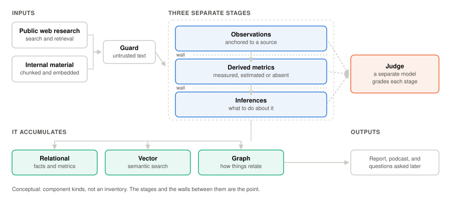

# Keeping up with a customer is harder than it looks

Most of the notes in this repo are about a measurement or decision inside two
systems I've built.  This one is the overview: what the systems are for, why the obvious
approach doesn't work, and why there's so much detail to write about in the first place.

## The problem

If you cover a set of large companies for a living — as an account team, a seller, a
technical specialist — staying current on them is a real and continuous cost.  Your
customers and prospects announce things, reorganise, change leadership, get regulated, get
acquired, take
on new initiatives.  All of this information makes up their public signal, and most of it
isn't something they tell you about, even if you're lucky enough to have regular meetings
with them and, if they're just a prospect, this public signal may be all you have.
Knowing this information matters a lot, and finding out takes hours that eat into all the
other productive work you could be doing instead.

Multiply that by a book of accounts and it stops being feasible to do properly.  It's the
kind of task that looks tailor-made for automation with a language model.

## Why "just ask an AI" isn't the answer

This is the part I'd most want someone to take away, because it's where the work actually
is.  Plenty of people have tried handling this with their own prompts and processes, and
I've watched a lot of those attempts up close.  The output looks great immediately and
holds up badly upon close inspection.

Here are some examples of the problems that show up every time.

**It makes things up.**  Not wildly — plausibly.  A model asked to summarise what happened
at a company will produce a confident, well-written paragraph about an executive
appointment that didn't happen, with a citation that looks real.  A report containing one
invented fact is worse than no report, because the reader can't tell which one it is and
now has to check everything.

**The sources are uneven.**  Search returns a mix of primary filings, decent trade press,
recycled press releases, SEO chaff and pages that no longer exist.  A model handed all of
that will treat the worst of it as equal to the best, and will happily build a finding on
a content-farm article that itself misread a press release from four years ago.

**Company names are ambiguous in ways that matter.**  Company A, Company A KGaA and Company
A PLC can be three unrelated businesses in different countries.  Search engines don't
distinguish them and neither do models.  Put a report in front of an account team with
another company's news in it and you've lost them — reasonably, because if that's wrong,
what else is?

There are plenty more.  Four that took real work:

**A source with no date defeats every rule about freshness.**  Everything protecting a report
from stale news — suppressing anything too old, flagging anything ageing — is computed from a
publication date.  A page that doesn't carry one isn't caught by any of it, so a four-year-old
article arrives looking exactly as current as this morning's.  You can't filter on what you
can't see.

**Links that look right and aren't.**  A model asked for its sources will happily write a URL
that is correctly formed, plausibly structured, and goes nowhere — or goes somewhere real that
has nothing to do with the sentence it's attached to.  Checking that every link both resolves
and actually contains what's claimed is its own piece of machinery.

**Ask the same question twice and you get different evidence.**  Running the same company
through the same pipeline on two consecutive days returns largely different sources.  That's
not a bug so much as how search behaves, but it makes "is this version better than that one?"
a genuinely hard question to answer, and it means any comparison has to be designed around the
variation rather than ignoring it.

**Retrieved pages sometimes try to give instructions.**  Anything that reads a web page and
passes it to a model has to treat that page as untrusted input, because text on it can be
written to look like a command rather than information.

None of these is exotic.  They're the normal condition, and each one has to be actively
engineered against rather than prompted away.  That's the honest reason both of the
projects below have a long list of open and closed issues: the issues *are* the work.
Generating a
report was a weekend.  Generating one worth reading has taken months and, although it's good
enough to ship and provide substantial value, I still see improvements worth making.
Get that wrong and instead of saving time you're wasting more of it, across a wider
audience.

## What comes out

Both systems produce the same shape of thing, per company, on a monthly cycle: an
HTML email that an account team actually reads because it's helpful, and a roughly
five-minute podcast called
Signal & Close — a few speakers, with one playing devil's advocate, talking through what
changed and what it means for the
solutions the account team is responsible for.  The audio exists because
it gets consumed in situations where a document doesn't, and it only shipped once the
voices and content were good enough to be worth the time.

## AIP Pulse

The simpler of the two, and the one in production.

It uses **public sources only** — news, company sites, regulatory filings, stated business
objectives.  What makes it worth reading is that it doesn't stop at reporting them.  Each
report also takes a view on what the news means for the team covering that account: which
developments are worth acting on, and where publicly documented technology capabilities line
up with what the company has just said it intends to do.  A feed of headlines delivered
direct to your email saves time, but the interpretation is the value that makes it
actionable for a specific account team with specific solutions.

Research, writing, evaluation and audio all run on local models on hardware in my home lab.
It's been delivering to account teams since February 2026, and has recently been expanded,
at leadership's request, to over 150 reports a month.

Most of the other write-ups here are about its internals, because it's the system with
real usage and real failure modes to study.

## AIP

The more ambitious system.

AIP Pulse makes that connection from public information alone.  AIP goes considerably
further, correlating what's happening at a company against internal knowledge and the
current state of the relationship with that account, to say something far more specific
about what the team should actually do.  Which approach fits this situation?  Which measures
are relevant, given what has worked elsewhere?  It is reliant on internal, proprietary
information to work effectively; simulated data was used to prove the concept to a high
level of confidence.

It also differs in a more fundamental way.  AIP Pulse produces a report and moves on.  AIP
*accumulates* — every run adds to a growing body of structured intelligence about the
accounts it covers, and that body becomes useful on its own terms.

<picture>
  <source media="(prefers-color-scheme: dark)" srcset="../images/aip-architecture-dark.svg">
  
</picture>

Several things make AIP substantially more advanced than AIP Pulse.

**Hybrid retrieval.**  Live web research is only one input.  Internal material is chunked and
embedded into a vector store and searched semantically alongside it, with structured facts in a
relational database and the relationships between companies, competitors, people and events
projected into a
graph.  A question can be answered from whichever of those actually holds the answer.

**Separating observing from judging.**  An earlier version asked a single step to do two jobs
at once: extract what the sources said, and classify what it meant for the relationship with
that account.  It did both badly — the dominant error wasn't bad facts, it was correct facts
dragged into wrong conclusions, like reading an analyst's investment write-up and concluding a
vendor was already deployed.  The current version splits that into three layers with a hard
wall between them: what was observed, what can be derived from it, and what can be inferred on
top.  Facts stop being contaminated by the judgment applied to them, and each layer can be
checked on its own terms.

**A store account teams can ask questions of.**  Because the intelligence accumulates rather
than being thrown away after each report, it can be queried directly — an account team can ask
across everything gathered about their accounts instead of re-reading twelve months of emails,
and the same store can be read programmatically by anything else that needs it.  The graph
projection makes some of that structural: organisation charts assembled from leadership changes
seen over time, and competitive positions laid out across accounts rather than one at a
time.  Adding this externally sourced, curated data to the internal data available provides
a much fuller understanding of the account.  The reports are the most visible output, but
they are just one use of the data.

**Comparing against a cohort rather than scoring an account.**  Scoring a single company on a
soft signal doesn't work — the extraction noise swamps it and everything saturates to the same
value.  Counting how many companies in a peer group show that signal works much better, because
the idiosyncratic noise falls away as the group grows.  So the useful questions become what a
cohort is converging on, and who the outlier is, rather than what one account scores.  Done
correctly, this has the potential to be useful to other groups beyond account teams, such as
product marketing and engineering.

**Judging its own output.**  Every fact it extracts is anchored to the source it came from,
and every metric it derives is labelled by where its value came from — **measured** from
evidence, **estimated**, or **absent** because nothing was found.

Not every metric is produced the same way, which matters for how much a score is worth.  Some
are passed straight through from hard data — a revenue figure, a headcount, the date of an
executive change.  Some are computed by a fixed formula.  Only the rest are scored by a model
against a written rubric with defined anchors, and those are the ones where a judgment is
actually being made.

A separate model then grades each run on all three layers: whether the extracted facts are
faithful to their sources, whether the derived metrics follow validly from those facts, and
whether the reasoning built on top is sound.

That scaffolding is the most useful thing I've built in either system.  It's what turns
"does this seem better?" into a question with an answer, and it's why the model comparisons
elsewhere in this repo were possible at all.  It also makes the system honest about its own
gaps: a metric marked *absent* is a visible hole rather than a confidently invented number.

## Where each one can run

AIP is not in production, and the reason is about data rather than quality.

AIP Pulse uses only public sources, so a home lab is a perfectly legitimate place for it.
AIP merges the public and private/internal signal to provide better and more actionable
insights; it benefits from direct integration with internal systems, such as CRM data,
customer success information, contact lists, etc.  Reports built from that shouldn't be
produced on personal hardware and
delivered from a personal email address, however well the system works.  That's a line I'm
not willing to cross, and it's a constraint on where the system can live rather than a
verdict on the system.  It may yet be implemented somewhere it belongs.

The same reasoning is why neither repository is public.  The code is bound up with a real
account roster, colleagues' contact details and internal material, none of which is mine
to publish.  These notes are what can be shared: the methods, the measurements, and what
I've learned along the way.

## Where to go next

- [Swapping out the research engine](self-hosted-vs-paid-research.md) — a paid deep-research
  API returned four times as much text as a self-hosted one and produced fewer grounded
  facts
- [Choosing an inference model](choosing-an-inference-model.md) — three models, and why the
  fastest one lost
- [Four text-to-speech models](choosing-a-tts-model.md) — what it took before the podcast was
  worth shipping

